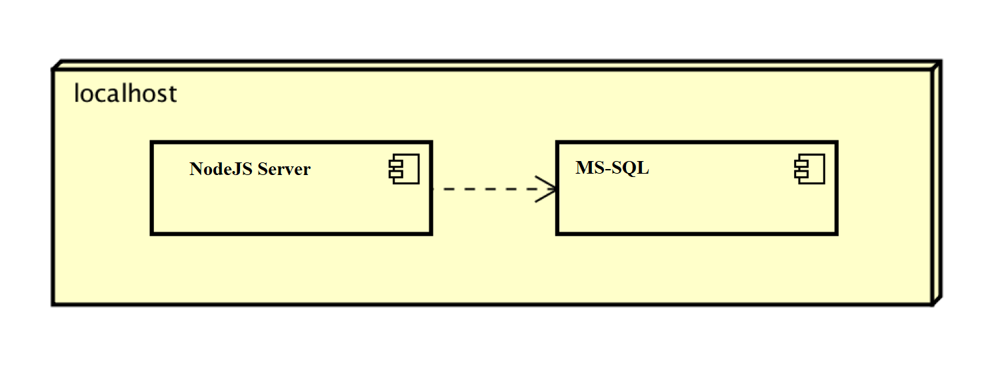
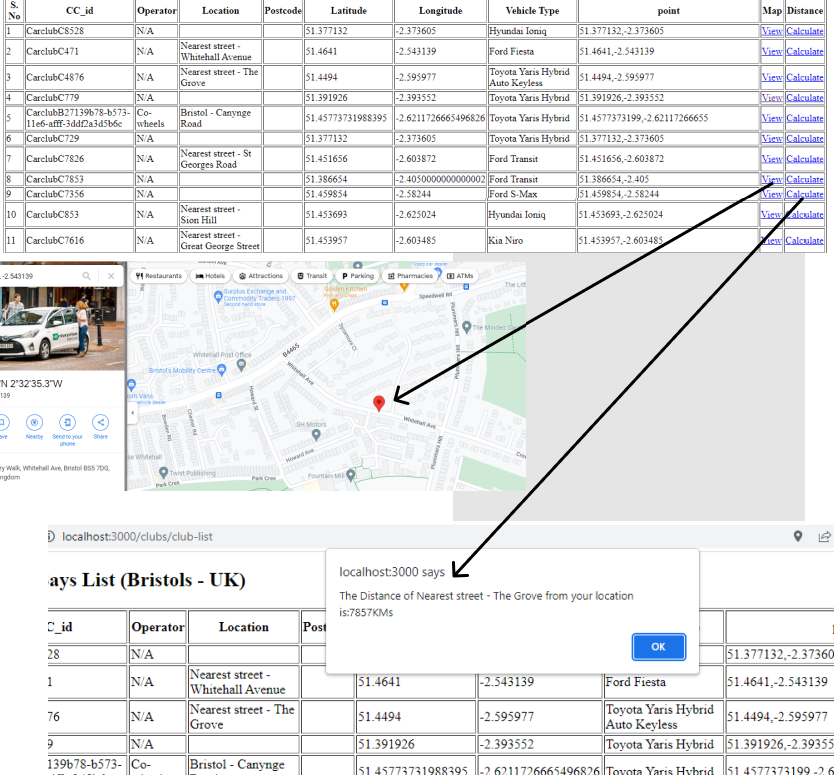

# Deployment

## Release Notes
Dependencies:
Nodejs
HTML
CSS

Software Tools/Programming Languages Used:
Nodejs 17.7.2
HTML 5
CSS 3
MySQL Server
Apache Server

# User guide
Use Case # 1:
The club list should open once we run the app:
1. Open Command Prompt
2. Point to the directory where the nodeapp files (like app.js, database.js) exist
3. Enter the command "node app.js" to run the application
4. Go to http://localhost:3000/clubs/club-list
5. You will see the list of Car Club Bays

Use Case # 2:
Once the http://localhost:3000/clubs/club-list is opened and ready clicking on view should display the location of selected car club bay on goolge map
1. Wait for the page to load
2. Once loaded click on view link given in front of every car club bay
3. Wait for the map to load
4. The map should display the map with the pointer that highlights the location of the car club bay or car parking.
[Insert screenshots here](images/usercase1-2.png)
Use Case # 3:
Once the http://localhost:3000/clubs/club-list is opened and ready clicking on calculate should display the distance of selected car club bay from the location of the user. 
1. Wait for the page to load
2. Once loaded click on calculate link given in front of every car club bay
3. Wait for the page to respond
4. The page should display the distance with the dialogue box that includes and ok button and distance between the user and car club bay.
[Insert screenshots here](images/usercase1-3.png)
