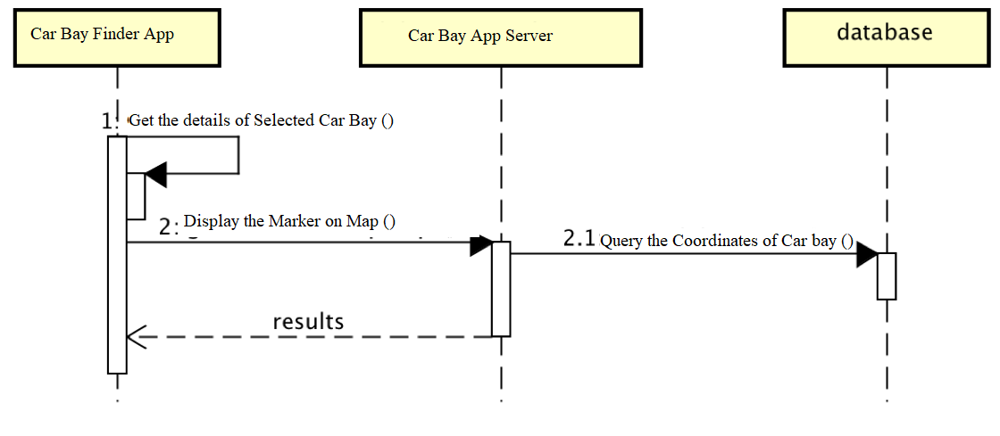
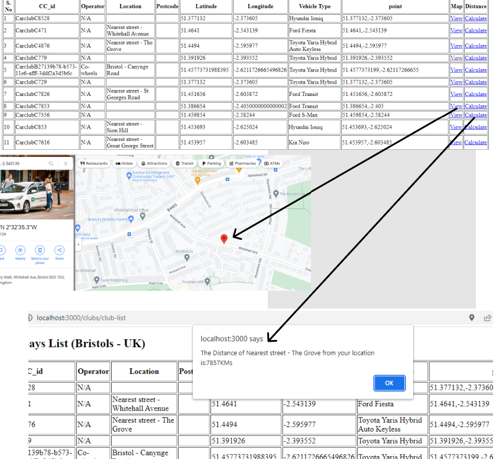
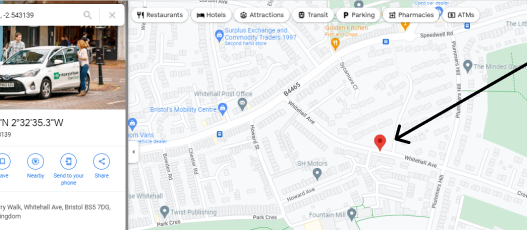
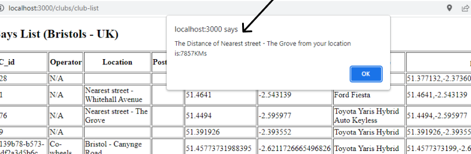

# Design

## Behavioural design
Use Case 1:
It display's the list of all the car club bays that exist in the city of Bristles with completed details.

Use Case 2:
It display's the location of the selected car parking or car club bay on the google map.

Use Case 3:
It display's the distance of the selected car parking or car club bay from the location of the user with a dialogue box.

## User Interface design
TODO: Specify and develop a user interface mockup using a wireframe.

Use Case 1:

Use Case 2:

Use Case 3:

