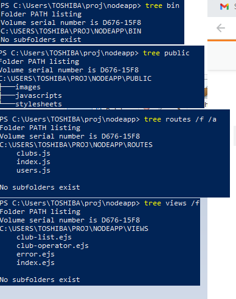

# Implementation

## Introduction
The system is implemented using MySQL, Node.js 16 version and javascript. The development of node module is a known issue.
It is very important to start the node.js application and install the dependencies of the project.

## Project Structure
provide a table listing the number of jslint warnings/reports for each module.
The node application has many files and folders in it when a project is created. We may ignore node_modules because it contains
the installed modules only. The short Description of other components of the are described breifly in this section.

Starting from Application Main Folder:
### app.js
This file contains the complete settings of the different required modules and ensures that the structure of the application is
properly managed.
### database.js
This file contains the code to connect wit the database server. It works as a bridge between the database server and the application server.
### package.js and package-lock.js
These files contain necessary settings of the application

Now let's Have a look at the other files and folders of this application
## bin
This folder contains the compilation scripts or any temporary files that are created during execution.
## public
This folder contains the different source files that are used in application. The folder is further divided into three directories that are
images to store images, javascripts to store javascript files and stylesheets to store CSS or style files.

## Routes
The different route files are stored in this folder. LIke the clubs.js file is used to route when we require the list of clubs. The users.js
file is used to get the list of users. The index.js works as a default file for this folder.

## views
This folder contains all the necessary files that are required to create the views in a nodejs application. For instance, the club-list.ejs file
in this application creates the view of the list, club-operator.ejs file works as a viewer for the list according to operator and error.ejs to 
display the errors.

## Software Architecture
TODO: Describe the major components of your architecture. Are any particular architectural styles being used?

