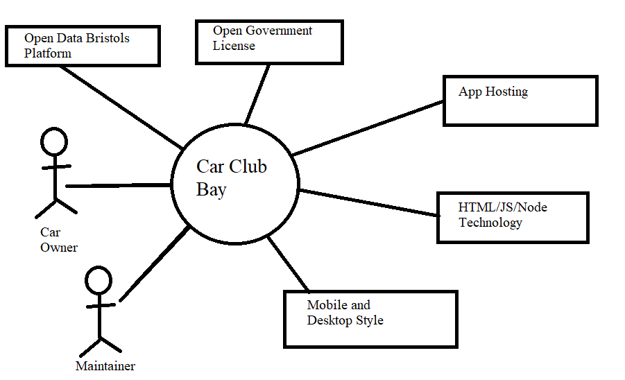

# Project Proposal

## Business Case

### Problem statement
TODO: Replace the example text like this with text that describes your project. What is the problem to be addressed?

### Business benefits
TODO: List high-level benefits that this product will provide.

### Options Considered
TODO: What are some other customer options or leading products that address the same needs?

### Expected Risks
TODO: What are the main risks of this project?

## Project Scope
TODO: Scope of the System of Interest. Include a bullet list of things from your context diagram that are in scope.

