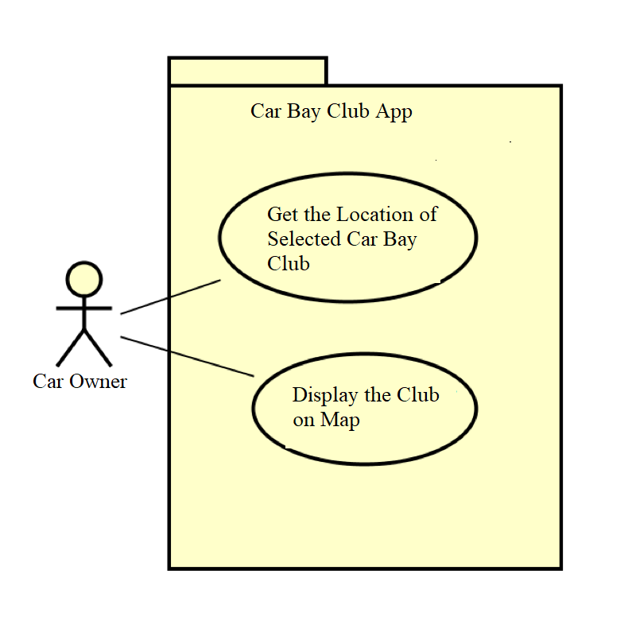

# Requirements

## User Needs
The car owners need to quickly find out the car parkings where they are in Bristols.
### User stories
1. As a taxi driver I want to locate car parkings so often so that I may park my taxi
2. As a car owner I often need the place to park my car.
3. As a truck driver I often want to find out the right places to park my vehicle.
### Actors
TODO: List and describe the actors/users for this product.

### Use Cases
TODO: Describe each use case (one per team member).
    Give each use case a unique ID, e.g. UC1, UC2, ...
    Summarise these using the use-case template below.

| USE-CASE 1 | List of CCBs | 
| -------------------------------------- | ------------------- |
 **Description**   | It should display a list of all the car parkings or CCBs situated in different locations of Bristols City |
| **Actors**        | Vehicle Owners and Drivers |
| **Assumptions**   | Nil
| **Steps**         |   1. Open Command Prompt
                        2. Point to the directory where the nodeapp files (like app.js, database.js) exist
                        3. Enter the command "node app.js" to run the application
                        4. Go to http://localhost:3000/clubs/club-list
                        5. You will see the list of Car Club Bays
| **Variations**    | None
| **Non-functional** | None
| **Issues**        | None

TODO: Your Use-Case diagram should include all use-cases.

## Software Requirements Specification
### Functional requirements
TODO: create a list of functional requirements. 
    e.g. "The system shall ..."
    Give each functional requirement a unique ID. e.g. FR1, FR2, ...
    Indicate which UC the requirement comes from.

### Non-Functional Requirements
TODO: Consider one or more [quality attributes](https://en.wikipedia.org/wiki/ISO/IEC_9126) to suggest a small number of non-functional requirements.
Give each non-functional requirement a unique ID. e.g. NFR1, NFR2, ...

Indicate which UC the requirement comes from.
